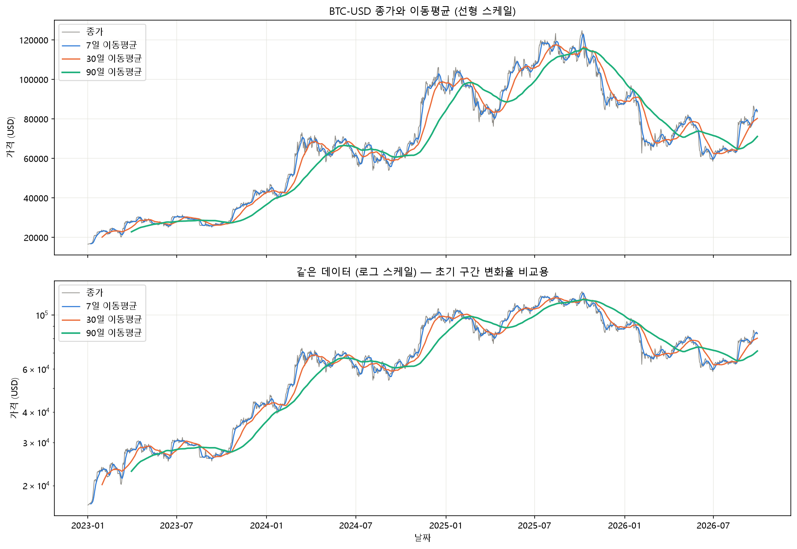
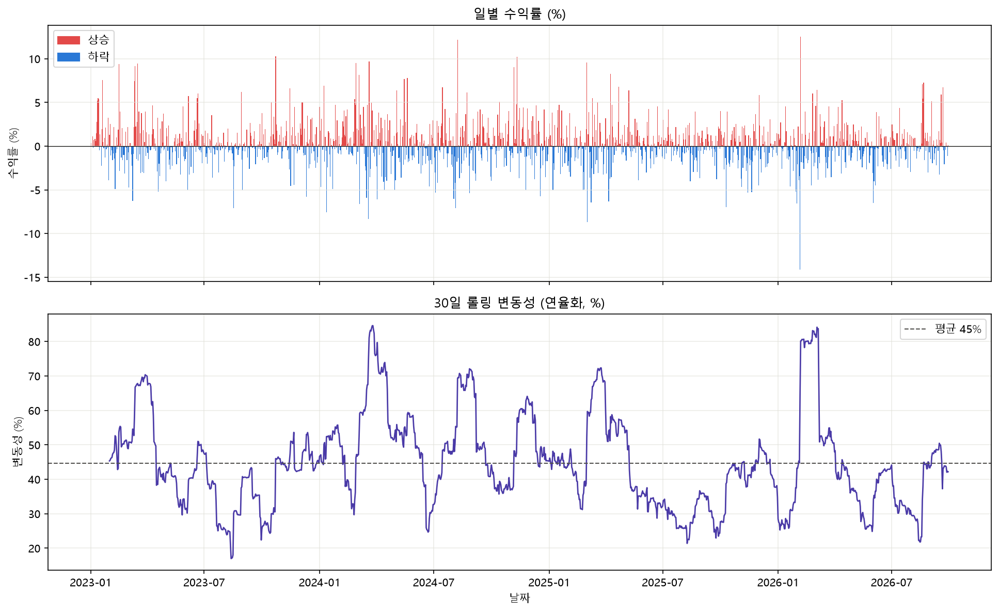
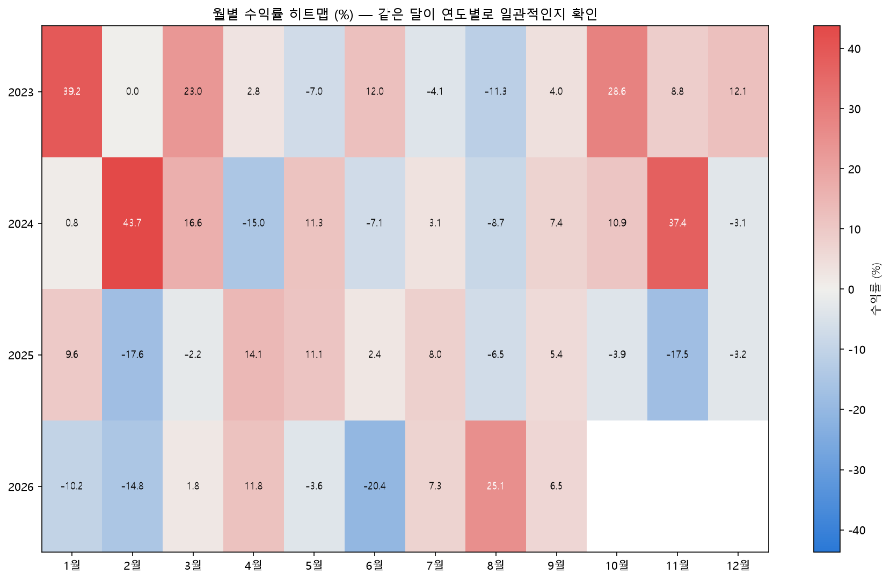
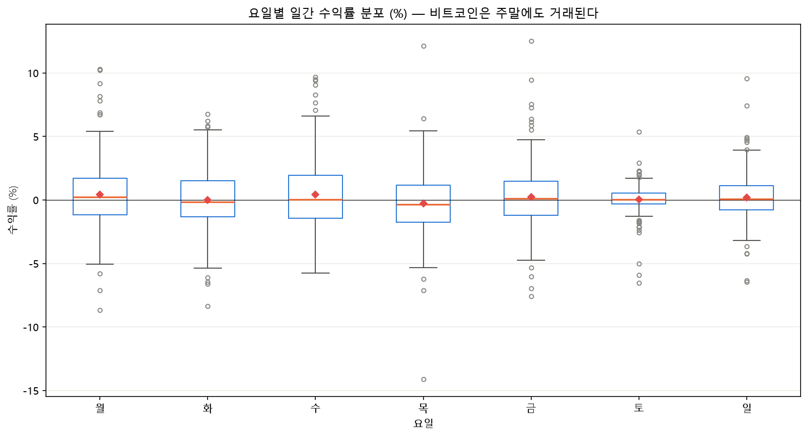
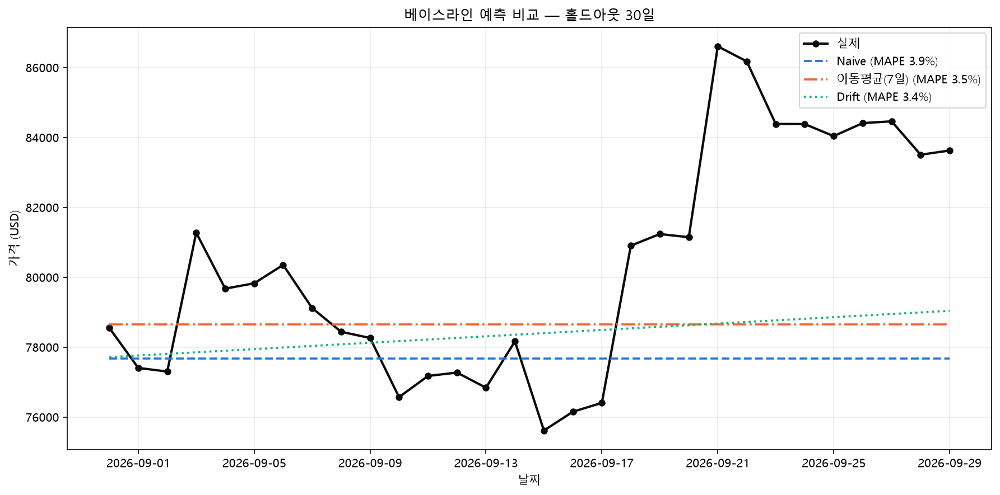

# 비트코인(BTC-USD) 시계열 분석 리포트

> 본 문서는 데이터 분석 학습 산출물이며, 투자 권유나 투자 조언이 아니다.

- 분석 대상: 비트코인 / 미국달러 (`BTC-USD`), 일(日) 단위 종가
- 분석 기간: **2023-01-01 ~ 2026-09-29** (1,368행)
- 모든 수치는 `analysis.ipynb`의 실제 실행 출력에서 가져왔다. 추정값이나 다시 반올림한 값은 쓰지 않았다.

---

## 1. 분석 주제 및 선정 이유

분석 주제는 **"2023년 이후 비트코인 가격 시계열에서 추세·변동성·반복 패턴을 구분해 읽어내고, 각 관찰에 대해 사실과 해석을 분리해 서술하는 것"** 이다.

비트코인을 고른 이유는 세 가지다.

1. **연중무휴 거래라 요일 분석이 가능하다.** 주식·ETF는 주말에 거래가 없으므로 "토요일 수익률"이라는 질문 자체가 성립하지 않는다. 비트코인은 365일 가격이 형성되므로 토·일요일을 평일과 같은 기준으로 비교할 수 있다. 실제로 본 분석의 요일별 표본 수는 월 196일, 화 196일, 수·목·금·토·일 각 195일로 요일 간 거의 균등하다(총 1,367일 = 1,368일 중 수익률 계산이 불가능한 첫날 제외).
2. **변동성이 커서 분석 기법의 효과가 뚜렷하게 드러난다.** 일간 수익률 표준편차가 2.44%, 30일 롤링 변동성(연율화) 평균이 44.7%에 달한다. 이동평균·롤링 표준편차 같은 기법을 적용했을 때 평활 전후의 차이가 그래프에서 눈으로 구분된다.
3. **추세 전환 구간이 여러 번 있어 관찰과 해석을 분리해 서술할 소재가 많다.** 기간 중 최저가 $16,625(2023-01-01)에서 최고가 $124,753(2025-10-06)까지 상승한 뒤, 2026-06-30까지 −53.1%의 최대 낙폭을 겪었다. 상승·하락·횡보 국면이 모두 한 시계열 안에 들어 있다.

### 기간 선정 근거

2023-01-01 이후 구간을 고른 이유는 **연도를 3개 이상 확보해야 월별 집계를 연도 간 교차 비교할 수 있기 때문**이다. 본 데이터는 2023·2024·2025·2026 네 개 연도를 포함한다. 2년치만으로는 "1월이 유리하다" 같은 주장을 우연과 구분할 표본 자체가 없다. (다만 4년도 충분하다는 뜻은 아니다 — 6절 인사이트 4에서 이 한계를 정량적으로 다룬다.)

수집은 2026-09-30까지를 목표로 했으나, 수집 시점에 2026-09-30 일봉이 아직 확정되지 않아 데이터는 **2026-09-29까지** 포함한다.

---

## 2. 분석 질문

| # | 질문 | 유형 |
| --- | --- | --- |
| Q1 | 2023~2026년 전체 추세는 상승인가? 이동평균 구조로 본 추세 전환 구간은 어디인가? | 그래프로 확인 가능 |
| Q2 | 변동성은 시간에 따라 어떻게 변했는가? 변동성이 집중되는 구간이 존재하는가? | 그래프로 확인 가능 |
| Q3 | 월별 수익률에 반복되는 패턴이 있는가? 연도를 바꿔도 같은 달이 유리한가? | 추가 해석 필요 |
| Q4 | 요일 효과가 존재하는가? 주말 수익률이 평일과 다른가? | 추가 해석 필요 |
| Q5 | 가장 단순한 예측(어제 가격 = 내일 가격)을 이동평균이나 추세 모델이 이길 수 있는가? | 보너스 (B) |

"그래프로 확인 가능"은 그림 한 장으로 답의 방향이 결정되는 질문이고, "추가 해석 필요"는 **그래프가 보여주는 것이 곧 답이 아니라 반증 대상**인 질문이다. Q3·Q4가 후자인 이유는 월별·요일별 평균이 표본이 작을수록 더 그럴듯한 패턴처럼 보이기 때문이며, 이 점이 6절 인사이트 4·5의 핵심이다.

---

## 3. 데이터 설명

| 항목 | 내용 |
| --- | --- |
| 대상 | 비트코인 / 미국달러 (`BTC-USD`) |
| 출처 | Yahoo Finance (`yfinance` 라이브러리) |
| 기간 | 2023-01-01 ~ 2026-09-29 (수집 목표는 2026-09-30이었으나 수집 시점에 해당 일자의 일봉이 확정되지 않아 제외됨) |
| 주기 | 일(日) 단위 |
| 행 수 | **1,368행** |
| 컬럼 | `Open`, `High`, `Low`, `Close`, `Volume` (모두 float64, 결측 0건) |
| 수집 방법 | `python fetch_data.py` → `data/btc_usd_2023_2026.csv`로 저장. 노트북은 이 CSV만 읽는다. |

### 종가 기술통계 (`raw.describe()`, 소수 2자리)

| 통계량 | Close (USD) |
| --- | --- |
| count | 1368 |
| mean | 66,992.13 |
| std | 28,918.78 |
| min | 16,625.08 |
| 25% | 41,257.50 |
| 50% | 66,928.29 |
| 75% | 90,514.42 |
| max | 124,752.53 |

### 수집과 분석을 분리한 이유

노트북이 실행할 때마다 네트워크에서 데이터를 내려받으면 실행 시점에 따라 결과가 달라져 **재현이 불가능해진다.** `fetch_data.py`로 한 번 수집해 CSV로 고정하고, `analysis.ipynb`는 그 CSV만 읽는다. 이 리포트의 모든 수치는 같은 CSV에서 같은 값으로 재현된다.

### 라이선스 주의

Yahoo Finance에서 제공하는 시세 데이터는 **개인·비상업적 용도로만** 사용이 허용된다. 재배포·상업적 이용은 제한되며, 본 저장소의 `data/*.csv`는 분석 재현 목적으로만 포함했다.

---

## 4. 데이터 정제 과정

### 4.1 적용한 기준과 근거

| 기준 | 처리 | 근거 |
| --- | --- | --- |
| 가격이 0 이하 | 해당 행 제거 | 거래 가능한 가격이 아니므로 분석 대상 신호가 아니라 데이터 오류다 |
| `High < Low` | 해당 행 제거 | 논리적으로 성립할 수 없는 행이므로 수집·기록 오류다 |
| 전일 대비 절대 변동률 50% 초과 | 해당 행 제거 | 비트코인에서도 하루 ±50%는 현실적 범위를 벗어나므로 분할·단위 오류를 의심한다 |
| 날짜 누락 | `asfreq('D')`로 전체 날짜에 재색인한 뒤 가격을 `ffill` | 거래 기록이 없는 날은 "값이 없는" 것이 아니라 "직전 가격이 유지된" 상태로 보는 것이 금융 시계열의 관례다 |
| `ffill`로 채운 날이 관여한 수익률 | 수익률 계산에서 제외 | 가짜 0% 수익률이 섞이면 변동성이 과소추정된다 |
| ±3σ를 넘는 극단 수익률 | **탐지만 하고 제거하지 않음** | 아래 4.2에서 별도 설명 |

### 4.2 극단 수익률을 제거하지 않은 이유

통계 분석에서 ±3σ를 넘는 값을 이상치로 보고 제거하는 관행이 있지만, **이 분석에서 그렇게 하면 분석 목적 자체가 훼손된다.** 비트코인의 하루 ±10% 변동은 센서 오작동이나 입력 실수 같은 측정 오류(노이즈)가 아니라, Q2가 측정하려는 대상인 **변동성 그 자체**다. 실제로 본 데이터에서 3σ를 넘는 날은 20일로 전체의 1.5%에 불과하지만, 이 20일을 지우면 연율 변동성 최대치 84.6%(2024-03-26)를 만들어낸 바로 그 구간이 사라진다. 즉 "변동성을 분석하기 위해 변동성을 제거하는" 자기모순이 된다. 따라서 **탐지하되 제거하지 않는다**는 원칙을 적용했고, 탐지된 20일은 6절 인사이트 3에서 분석 대상으로 직접 다룬다.

데이터 오류(위 표의 상위 3개 기준)와 극단 수익률을 구분하는 선은 "그 값이 시장에서 실제로 형성된 가격인가"이다. 오류는 가격이 아니므로 제거하고, 급변동은 가격이므로 남긴다.

### 4.3 기준 적용 결과 (실제 건수)

| 점검 항목 | 결과 |
| --- | --- |
| 데이터 오류 행 (가격 0 이하 / `High < Low` / ±50% 초과) | **0건** |
| 전체 날짜 재색인 후 행 수 | 1,368행 (재색인 전과 동일) |
| 원본에 없던 날짜 (누락 날짜) | **0건** |
| `ffill`로 보간한 날짜 | **0건** |
| 보간 후 종가 결측 | **0건** |
| ±3σ 초과 일자 (탐지만, 제거하지 않음) | 20일 (전체의 1.5%) |

**이 결과를 정확히 읽는 법**: 위 기준을 데이터에 적용해 점검한 결과, **고쳐야 할 것이 하나도 없었다.** 행이 제거된 적도, 날짜가 보간된 적도 없다. 수집된 1,368일이 이미 완전하고 연속적이었다는 뜻이다. 이는 정제가 수행되었다는 의미가 아니라 **정제 기준을 통과했다**는 의미이며, 분석에 사용된 데이터는 수집된 원본과 동일하다. 0건이라는 결과는 실패가 아니라 그 자체로 하나의 점검 결과다 — Yahoo Finance의 BTC-USD 일봉이 이 기간에 대해 빠진 날 없이 제공되었음을 확인한 것이다.

### 4.4 적용한 분석 기법

| 기법 | 적용 이유 |
| --- | --- |
| 이동평균 7 / 30 / 90일 | 단기 노이즈를 걷어내 추세를 분리하고, 선 간 위치 관계로 추세 전환 구간을 식별한다 (Q1) |
| 일별 변화율 · 누적 수익률 | 가격 레벨이 크게 다른 구간을 공정하게 비교하기 위해 절대 가격 대신 비율로 환산한다 |
| 30일 롤링 표준편차 (연율화, `sqrt(365)`) | 변동성의 시간 변화를 측정한다. 연중무휴 거래이므로 252일이 아니라 365일로 연율화한다 (Q2) |
| 월별 / 요일별 집계 | 반복 패턴(계절성)의 존재 여부를 검증한다 (Q3, Q4) |
| 최대 낙폭 (MDD) | 하락 리스크 규모를 단일 수치로 요약한다 |
| 베이스라인 예측 3종 (Naive / 이동평균 / Drift) | 단순 모델 대비 개선 여부를 측정한다 (Q5) |

---

## 5. 분석 결과 및 시각화

> **색상 규칙 주의**: 본 리포트의 그래프는 **한국 금융 관행(상승 = 빨강, 하락 = 파랑)** 을 따른다. 미국 관행(상승 = 초록, 하락 = 빨강)과 반대이므로, 다른 관행에 익숙한 독자는 빨간 막대가 상승이라는 점에 주의해야 한다.

### 5.1 가격 추이와 이동평균



**관찰**:

- 기간 전체로 보면 시작가 $16,625(2023-01-01)에서 종료가 $83,622(2026-09-29)로 **누적 +403.0%** 상승했다. 기간 최고가는 $124,753(2025-10-06), 최저가는 $16,625(2023-01-01)이다.
- 상단 선형축 패널에서 가격은 단조 상승이 아니다. 2023년 중반의 횡보, 2023년 말~2024년 초의 급등, 2024년 중반의 횡보, 2024년 말~2025년의 추가 상승, 그리고 2025-10-06 고점 이후의 하락 국면이 차례로 나타난다.
- 이동평균 세 선(7·30·90일)의 상하 위치 관계가 국면마다 바뀐다. 상승 구간에서는 7일선이 30일선 위, 30일선이 90일선 위에 정렬되고, 2025-10-06 고점 이후 하락 구간에서는 이 순서가 역전되어 90일선이 가장 위에 놓인다. 기간 마지막 구간에서는 종가와 7일선이 다시 30일선·90일선을 위로 통과한 상태로 끝난다.
- 90일선은 2026년 하락 구간에서 가장 늦게 방향을 바꾼다. 평활 구간이 길수록 추세 전환을 늦게 반영한다는 이동평균의 구조적 성질이 그대로 보인다.

**로그축을 함께 둔 이유**: 기간 중 가격이 $16,625에서 $124,753까지 수 배로 변해, 선형축만으로는 2023년 초반 구간의 변화율이 화면 아래쪽에 눌려 평평해 보인다. 로그축 패널에서는 같은 비율 변화가 같은 세로 거리로 표현되므로, 2023년 초의 상승이 2025년 $100,000대 구간의 등락과 공정하게 비교된다.

### 5.2 일별 수익률과 롤링 변동성



**관찰**:

- 일평균 수익률은 0.1478%, 일간 표준편차는 2.44%다. 평균의 16배가 넘는 표준편차로, 하루 단위에서는 추세보다 변동이 압도적으로 크다.
- 30일 롤링 변동성(연율화)은 평균 44.7%, 최대 84.6%(2024-03-26), 최소 17.0%(2023-08-13)다. 최대와 최소가 약 5배 차이로, 변동성이 기간 내내 일정하지 않다.
- 하단 패널에서 변동성은 평균선(45%) 주변을 무작위로 오가지 않고, **높은 구간과 낮은 구간이 각각 수 주~수 개월씩 뭉쳐서 나타난다.** 2024년 초~중반과 2026년 초 구간에서 80%대 봉우리가, 2023년 중반과 2025년 중반 구간에서 20%대 골짜기가 형성된다.
- 상단 패널에서도 ±5%를 넘는 막대가 달력 전체에 고르게 흩어지지 않고 특정 구간에 몰려 있다. 가장 긴 아래쪽 막대는 −14.13%(2026-02-05)이고, 바로 다음 날 +12.52%(2026-02-06)의 가장 긴 위쪽 막대가 나타난다.

### 5.3 월별 수익률 히트맵



**관찰**:

- 월별 평균 수익률(%)은 1월 9.8, 2월 2.8, 3월 9.8, 4월 3.4, 5월 3.0, 6월 −3.3, 7월 3.6, 8월 −0.4, 9월 5.8, 10월 11.8, 11월 9.6, 12월 1.9이다.
- 그러나 평균이 아니라 **연도별 부호 일관성**으로 보면 색이 한 방향으로 정렬된 열이 거의 없다. 부호 일관성(양수 연도 / 전체 연도)은 1월 3/4, 2월 2/4, 3월 3/4, 4월 3/4, 5월 2/4, 6월 2/4, 7월 3/4, 8월 1/4, 9월 4/4, 10월 2/3, 11월 2/3, 12월 1/3이다. (10~12월은 2026년 데이터가 없어 분모가 3이다.)
- 같은 달의 연도별 값이 크게 갈린다. 2월은 2024년 +43.7%와 2025년 −17.6%, 11월은 2024년 +37.4%와 2025년 −17.5%로 부호와 규모가 모두 반대다. 1월도 2023년 +39.2%와 2026년 −10.2%로 갈린다.
- **9월만 4/4로 네 해 모두 양수**다(2023 +4.0%, 2024 +7.4%, 2025 +5.4%, 2026 +6.5%). 다만 9월 평균 +5.8%는 10월 +11.8%, 1월·3월 +9.8%보다 낮다 — "항상 양수지만 크게 오르지는 않는" 열이다. 이 4/4를 월 효과로 볼 수 있는지는 6절 인사이트 4에서 별도로 다룬다.

### 5.4 요일별 수익률 분포



**관찰**:

- 요일별 일간 수익률(평균 / 중앙값 / 표준편차, %, 표본 수)은 다음과 같다.

| 요일 | 평균 | 중앙값 | 표준편차 | 표본 수 |
| --- | --- | --- | --- | --- |
| 월 | 0.437 | 0.229 | 2.897 | 196 |
| 화 | 0.000 | −0.160 | 2.464 | 196 |
| 수 | 0.419 | 0.035 | 2.765 | 195 |
| 목 | −0.279 | −0.357 | 2.601 | 195 |
| 금 | 0.227 | 0.105 | 2.712 | 195 |
| 토 | 0.034 | 0.036 | 1.202 | 195 |
| 일 | 0.196 | 0.061 | 1.968 | 195 |

- 요일 간 평균 차이의 최대 폭은 월요일 0.437%와 목요일 −0.279%로 0.716%p다. 그러나 각 요일의 표준편차는 1.202%~2.897%로, **평균 차이보다 같은 요일 안의 산포가 1.7~4배 크다**(토요일 1.202/0.716 = 1.7배 ~ 월요일 2.897/0.716 = 4.0배).
- 박스플롯에서 일곱 개 상자는 모두 0% 선을 가로지르고, 중앙값 선(주황)도 −0.357%~+0.229%의 좁은 범위에 모여 있다. 상자 높이(사분위 범위)의 차이가 중앙값 차이보다 훨씬 크다.
- **토·일요일은 평균이 다르다기보다 산포가 좁다.** 토요일 표준편차 1.202%는 7개 요일 중 가장 작고 수요일 2.765%의 절반 이하이며, 일요일 1.968%도 평일 5개 중 어느 요일보다 작다. 박스플롯에서도 토·일의 상자와 수염이 눈에 띄게 짧다.

### 5.5 베이스라인 예측



**관찰**:

- 홀드아웃 구간은 2026-08-31 ~ 2026-09-29(30일)이며, 이 구간의 실제 변화는 **+6.5%**이며, 구간 마지막 종가는 기간 종료가와 같은 $83,622다.
- 세 베이스라인 중 Naive(파랑 파선)와 이동평균(주황 일점쇄선)은 수평선으로, Drift(초록 점선)는 완만한 우상향 직선으로 그려진다. 실제값(검정)은 그래프상 기간 전반 $75,600~$81,300 구간에서 등락하다가 2026-09-17 이후 상승해 $86,000대까지 올랐다.
- 세 모델 모두 2026-09-21 전후의 상승 구간을 따라가지 못한다. 그래프 오른쪽에서 실제값과 세 예측선의 세로 간격이 가장 크게 벌어진다.
- 상승 구간이 뒤쪽에 몰려 있어, 수평선 두 개보다 **조금이라도 위로 기울어진 Drift 선이 오차 면적에서 유리**하다. 수치로도 Drift의 MAE가 가장 낮다(7절 참조).

---

## 6. 인사이트

### 인사이트 1: 전체는 큰 폭의 상승이지만, 그 경로는 여러 번의 국면 전환을 거쳤다

- **관찰(Fact)**: 2023-01-01 $16,625에서 2026-09-29 $83,622로 누적 **+403.0%**. 그러나 일평균 수익률은 0.1478%에 불과하고 일간 표준편차는 2.44%다. 이동평균 7/30/90일의 상하 정렬 순서가 2023년 중반 횡보, 2023년 말~2024년 초 급등, 2024년 중반 횡보, 2025-10-06 고점 이후 하락 구간에서 각각 바뀐다. 기간 최고가 $124,753(2025-10-06), 최저가 $16,625(2023-01-01).
- **해석(Why)**: ① 평균 수익률의 16배가 넘는 표준편차는 이 시계열의 하루 단위 움직임이 추세보다 잡음에 가깝다는 뜻이며, 그래서 7일선만으로는 국면을 판별하기 어렵고 30·90일선과의 상대 위치가 필요하다. ② 이동평균 정렬이 여러 번 바뀐다는 것은 단일 추세 모형(예: 선형 추세 하나)으로 전 기간을 설명하려는 시도가 구조적으로 실패한다는 신호다. 각 국면이 서로 다른 수급·유동성 환경에서 형성되었을 가능성이 있다 **(검증 필요)**.
- **행동(Action)**: 전 기간을 하나로 묶은 통계(평균 수익률, 평균 변동성)를 의사결정 근거로 쓰지 않는다. 대신 이동평균 정렬을 기준으로 국면을 먼저 나누고, 국면별로 같은 지표를 다시 계산해 국면 간 차이가 유의한지 확인하는 것이 다음 분석 과제다.

### 인사이트 2: 변동성은 상수가 아니라 뭉쳐서 나타난다 (변동성 집중)

- **관찰(Fact)**: 30일 롤링 변동성(연율화)의 평균은 **44.7%**, 최대는 **84.6%(2024-03-26)**, 최소는 **17.0%(2023-08-13)** 로 최대/최소 비율이 약 5배다. 그래프상 80%대 봉우리와 20%대 골짜기가 각각 수 주~수 개월 길이의 덩어리로 나타나며, 평균선(45%)을 중심으로 무작위하게 진동하지 않는다.
- **해석(Why)**: ① 변동성 집중(volatility clustering)은 금융 시계열에서 널리 관찰되는 성질로, 큰 변동이 있은 날 다음 날도 큰 변동이 날 확률이 높다는 구조에서 나온다. 가격 충격이 시장 참여자의 포지션 조정을 유발하고 그 조정이 다시 변동을 낳는 되먹임으로 설명된다. ② 이런 되먹임은 레버리지가 높은 시장에서 더 강하게 나타나는 경향이 있으며, 2024년 초와 2026년 초의 80%대 구간이 그런 국면에 해당할 수 있다 **(검증 필요)**.
- **행동(Action)**: "평균 변동성 44.7%"라는 단일 수치를 리스크 가정으로 쓰면 고변동 구간에서 위험을 절반 수준으로 과소평가하게 된다. 변동성을 상수로 두는 대신 롤링 변동성을 상태 변수로 삼아, 현재 구간이 고변동 국면인지 저변동 국면인지 먼저 분류하는 절차를 추가해야 한다. GARCH 계열 모형으로 집중 구조를 명시적으로 모델링하는 것이 자연스러운 확장이다.

### 인사이트 3: 극단적인 날은 하락보다 상승 쪽에 네 배 많다 — 그러나 깊이는 하락이 더 깊다

- **관찰(Fact)**: ±3σ를 넘는 날은 **20일(전체의 1.5%)** 이며, 그중 **하락 4일 / 상승 16일**이다. 하락 4일은 2026-02-05(−14.13%, z=−5.85), 2025-03-03(−8.68%, z=−3.62), 2024-03-19(−8.34%, z=−3.48), 2024-01-12(−7.58%, z=−3.16)이고, 상승 상위 5일은 2026-02-06(+12.52%, z=+5.07), 2024-08-08(+12.14%, z=+4.91), 2023-10-23(+10.31%, z=+4.16), 2024-11-11(+10.22%, z=+4.13), 2024-03-20(+9.69%, z=+3.91)이다. 하락 최대일(2026-02-05) **바로 다음 날**이 상승 최대일(2026-02-06)이다.
- **해석(Why)**: ① 개수는 상승이 4배 많지만 **단일 최대 절댓값은 하락 쪽(−14.13%)** 이 상승 쪽(+12.52%)보다 크다. 즉 "하락은 드물지만 한 번에 깊다"는 비대칭이며, 개수만 보고 "상승 편향"이라고 읽으면 틀린다. **또한 16:4라는 비율 자체를 과신해서는 안 된다** — 표본이 20일뿐이라 몇 건만 바뀌어도 비율이 크게 흔들리고, 수익률 분포가 오른쪽으로 치우쳐 있으면 z-score 기준선을 긋는 것만으로도 상승 쪽 초과 건수가 기계적으로 더 많이 잡힌다. Q3·Q4에 적용한 것과 같은 기준을 여기에도 적용하면, 이 비대칭은 확인된 사실이되 그 크기를 해석하려면 추가 검정이 필요하다. ② 하락 최대일 다음 날이 상승 최대일이라는 사실은 두 날이 독립 사건이 아니라 하나의 급변동 에피소드의 앞뒤일 가능성을 시사한다. 급락 이후의 반발 매수, 또는 강제 청산이 소진된 뒤의 되돌림으로 설명될 수 있다 **(검증 필요)**. ③ 이 깊이의 단일 하락은 광범위한 디레버리징 에피소드와 양립하는 형태지만, 구체적인 촉발 요인은 본 데이터만으로 특정할 수 없다 **(검증 필요)**.
- **행동(Action)**: 극단값 20일을 "제거할 이상치"가 아니라 **별도 분석 대상**으로 다룬다. 구체적으로 (a) 극단일 전후 5일의 거래량 변화 확인, (b) 하락 극단일 직후 n일 수익률의 분포가 전체 분포와 다른지 검정, (c) 각 극단일에 실제로 어떤 사건이 있었는지 1차 자료로 확인해 위 가설들을 검증하는 작업이 다음 단계다.

### 인사이트 4: 월별 계절성은 확인되지 않았다 — 9월 4/4는 발견이 아니다

- **관찰(Fact)**: 월별 부호 일관성(양수 연도/전체 연도)은 1월 3/4, 2월 2/4, 3월 3/4, 4월 3/4, 5월 2/4, 6월 2/4, 7월 3/4, 8월 1/4, **9월 4/4**, 10월 2/3, 11월 2/3, 12월 1/3이다. 9월을 제외하면 4년치가 있는 달(1~9월)은 모두 1/4~3/4, 3년치뿐인 달(10~12월)은 1/3~2/3 구간에 있다. 같은 달의 연도별 편차는 매우 크다 — 2월은 2024년 +43.7%와 2025년 −17.6%, 11월은 2024년 +37.4%와 2025년 −17.5%, 1월은 2023년 +39.2%와 2026년 −10.2%다.
- **해석(Why)**: **9월의 4/4는 월 효과의 증거가 아니다.** 근거는 두 가지다. ① **표본이 작다.** 9월은 연도가 4개뿐이므로, 각 해가 동전 던지기처럼 독립적으로 50% 확률로 양수가 된다고 가정하면 특정 달이 4/4가 될 확률은 (1/2)⁴ = **1/16 = 6.25%** 다. 드물긴 하지만 "일어날 리 없는 일"은 전혀 아니다. (달마다 표본 수가 같지 않다는 점도 짚어 둔다 — 1~9월은 4개 연도, 10~12월은 2026년 데이터가 없어 3개 연도뿐이다. 3년치 달에서 "전부 양수"가 나올 확률은 (1/2)³ = **1/8**로 더 높으므로, 1/16이라는 기준은 4년치인 1~9월에만 적용된다.) ② **다중 비교 문제가 있다.** 9월 하나만 미리 지목해 검정한 것이 아니라 **12개 달을 동시에 살펴본 뒤** 가장 극단적인 열을 고른 것이다. 4년치인 9개 달만 놓고 보아도 *그중 어느 하나라도* 4/4가 될 확률은 1 − (15/16)⁹ ≈ **44%**, 12개 달이 모두 4년치라고 가정하면 1 − (15/16)¹² ≈ **54%** 다. 어느 쪽으로 세어도 **대략 절반**이다. 즉 **아무 패턴이 없는 데이터에서도 이런 열이 하나쯤 나오는 것이 오히려 정상이다.** 9월 평균 수익률 +5.8%가 10월 +11.8%, 1월·3월 +9.8%보다 낮다는 점도 "9월이 특별히 유리한 달"이라는 서술과 맞지 않는다. 같은 달의 연도별 부호가 뒤집히는 사례(2월·11월·1월)가 다수 존재한다는 사실은 월이 수익률을 설명하는 변수가 아님을 직접 보여준다.
- **결론**: **Q3의 답은 "월별 반복 패턴은 확인되지 않았다"이다.** 이것은 분석의 실패가 아니라 분석의 결과다. 4년 표본과 12회 동시 비교라는 조건에서 9월의 4/4는 우연과 구분할 수 없으며, 구분할 수 없는 것을 패턴이라고 쓰는 것이 분석에서 더 큰 오류다.
- **행동(Action)**: 9월 효과를 주장하려면 (a) 표본 연도를 최소 15~20년으로 늘려 4/4가 유지되는지 보고, (b) 9월을 **사전에 지정한 뒤** 별도 기간에서 검정하며, (c) 12개월 동시 검정에 대한 다중 비교 보정(예: Bonferroni)을 적용해야 한다. 세 조건을 모두 만족하기 전까지 본 리포트는 월 효과를 주장하지 않는다. 현재 데이터로 할 수 있는 정직한 다음 단계는 월 단위를 버리고 계절이 아니라 **변동성 국면**으로 구간을 나누는 것(인사이트 2)이다.

### 인사이트 5: 요일 효과도 확인되지 않았다 — 다만 주말의 "산포"는 평일과 다르다

- **관찰(Fact)**: 요일별 평균 수익률(%)은 월 0.437, 화 0.000, 수 0.419, **목 −0.279**, 금 0.227, 토 0.034, 일 0.196이다. 최대 평균 차이는 월−목의 0.716%p다. 반면 같은 요일 안의 표준편차는 토 1.202, 일 1.968, 화 2.464, 목 2.601, 금 2.712, 수 2.765, 월 2.897로 **산포가 평균 차이보다 1.7~4배 크다**(토요일 1.7배 ~ 월요일 4.0배). 일곱 요일 모두에서 산포가 평균 차이를 웃돈다. 표본 수는 요일당 195~196일이다.
- **해석(Why)**: ① **목요일 −0.279%를 "목요일 효과"로 읽으면 안 된다.** 요일 내 표준편차 2.601%에 표본 195일이면 평균의 표준오차는 대략 0.19%p 수준이고, −0.279%는 그 2배 안쪽이다. 게다가 9월의 경우와 똑같이 **7개 요일을 동시에 본 뒤 가장 낮은 하나를 고른 것**이므로 다중 비교 문제가 그대로 적용된다. 7개 중 하나가 이 정도로 치우치는 것은 아무 효과가 없어도 흔히 일어난다. ② **반면 토·일요일의 좁은 산포는 평균 차이와 성격이 다르다.** 토요일 표준편차 1.202%는 가장 큰 월요일 2.897%의 41% 수준으로 차이가 크고, 토·일 두 요일이 함께 낮다는 점에서 단일 요일의 우연으로 보기 어렵다. **다만 이 차이에 대해서도 분산 동일성 검정을 수행하지 않았으므로, 효과 크기가 평균 차이보다 크다는 것까지가 데이터로 말할 수 있는 전부다** — 통계적으로 유의하다고 주장하지 않는다(아래 행동 항목의 Levene 검정이 바로 그 공백을 메우기 위한 과제다). 기관 거래 데스크와 전통 금융 시장이 쉬는 주말에는 참여자와 유동성이 줄어 가격을 크게 움직일 주문 흐름 자체가 적어진다는 설명이 구조적으로 자연스럽다 **(검증 필요 — 본 데이터로는 참여자 구성을 직접 확인할 수 없다)**.
- **결론**: **Q4의 답은 "요일별 평균 수익률 차이는 확인되지 않았다. 단, 주말은 평균이 아니라 변동 폭에서 평일과 다르게 나타난다"이다(기술통계 기준이며, 검정은 수행하지 않았다).** 수익률의 방향에는 요일 효과가 없고, 수익률의 크기에는 주말/평일 구분이 보인다.
- **행동(Action)**: 평균 비교를 반복하는 대신 **분산을 분석 대상으로 바꾼다.** 구체적으로 (a) 주말 그룹과 평일 그룹의 분산이 같은지 검정(Levene 등), (b) 요일별 거래량(`Volume`)을 같은 방식으로 집계해 산포 차이가 거래량 차이와 함께 움직이는지 확인, (c) 주말에 시작된 급변동이 월요일에 어떻게 반영되는지 확인하는 것이 다음 과제다.

### 인사이트 6: +403%라는 숫자만 보면 −53.1%의 구간을 놓친다

- **관찰(Fact)**: 기간 누적 수익률은 **+403.0%**이지만, 같은 기간의 **최대 낙폭(MDD)은 −53.1%** 이며 2025-10-06 고점($124,753)에서 2026-06-30 저점까지 이어졌다. 즉 기간 최고점에서 진입했다면 자산이 절반 이하로 줄어드는 구간을 지나야 했고, 그 구간은 2025-10-06부터 2026-06-30까지 8개월이 넘는다. 2026-09-29 종가 $83,622는 2025-10-06 고점보다 여전히 한참 아래다.
- **해석(Why)**: ① 누적 수익률은 **시작점과 끝점 두 개만** 쓰는 통계이므로 그 사이의 경로를 전혀 담지 못한다. 같은 +403%라도 완만히 오른 경로와 절반으로 떨어졌다 회복한 경로는 보유자가 감당해야 하는 것이 전혀 다르다. ② 8개월 넘게 이어진 −53.1%의 하락은 단일 급락 사건이 아니라 지속적인 매도 압력이 작동한 국면의 형태이며, 광범위한 디레버리징 에피소드와 양립한다 **(검증 필요 — 본 리포트는 이 구간에 어떤 사건이 있었는지 확인하지 않았다. AI의 지식 기준일이 2026년 5월이므로 이 구간의 상당 부분이 확인 범위 밖이다)**.
- **행동(Action)**: 수익률 지표를 보고할 때 **누적 수익률과 MDD를 항상 쌍으로 제시**한다. 한쪽만 제시하는 보고서는 경로 위험을 숨긴다. 추가 과제로는 (a) 회복 기간(고점 재도달까지 걸린 일수) 계산 — 본 데이터 기간 내에는 아직 회복되지 않았으므로 하한만 알 수 있다, (b) 과거 하락 국면들의 깊이와 길이 분포를 집계해 −53.1%가 이 자산에서 얼마나 예외적인지 가늠하는 것이 있다.

---

## 7. 보너스: 베이스라인 예측

### 7.1 설정

- **분할**: 마지막 30일(**2026-08-31 ~ 2026-09-29**)을 홀드아웃으로 분리하고, 그 이전 데이터만 학습에 사용했다. 홀드아웃 구간의 어떤 값도 모델 적합에 쓰이지 않는다(미래 데이터 누수 차단).
- **홀드아웃 구간 실제 변화**: **+6.5%** (구간 마지막 종가 $83,622)
- **모델 3종**: Naive(마지막 관측값 유지), 이동평균(최근 7일 평균 유지), Drift(최근 추세의 평균 변화량을 선형 연장)

### 7.2 평가 결과

| 모델 | MAE | MAPE (%) | 방향 정확도 (%) |
| --- | --- | --- | --- |
| Naive | 3,191.70 | 3.85 | 0.0 |
| 이동평균(7일) | 2,877.90 | 3.50 | 70.0 |
| **Drift** | **2,819.27** | **3.42** | 70.0 |

**MAE 최저 모델: Drift** (MAE 2,819.27, MAPE 3.42%)

### 7.3 방향 정확도를 모델 순위에 쓰지 않는 이유

방향 정확도는 예측 시작 시점(`origin_value`, 학습 구간 마지막 종가) 대비 상승/하락 부호가 실제와 일치한 비율이다. 이 정의 때문에 다음이 성립한다.

1. **Naive만 구조적으로 0%가 나온다.** Naive의 예측값은 `origin_value`와 정확히 같으므로 부호가 항상 0이고, 실제 부호는 +1 또는 −1이므로 둘이 일치할 수 없다.
2. **이동평균과 Drift는 다르다.** 두 모델은 `origin_value`와 다른 수준(각각 학습 구간 마지막 7일 평균, 추세 연장값)을 예측하므로, 부호가 +1 또는 −1 중 하나로 예측 구간 전체에서 고정된 상수가 된다. 이번 실행에서 Naive 0.0%, 이동평균 70.0%로 나타난 것이 그 증거다 — 상수를 예측한다고 해서 0%가 되는 것은 아니다.
3. **그 결과 이 지표는 일별 방향 예측 능력이 아니라 "예측 기간 전체에 대한 단 한 번의 방향 베팅"이 맞았는지를 측정한다.** 이동평균과 Drift의 70.0%는 둘 다 "상승" 쪽에 건 한 번의 베팅이 홀드아웃 30일 중 21일에서 맞았다는 뜻이지, 하루하루의 방향을 70% 맞혔다는 뜻이 아니다.

따라서 **이 지표만으로 모델 간 우열을 판단해서는 안 되며, 모델 순위는 MAE·MAPE로 판단한다.** (이 설명은 `btc_analysis.evaluate_forecast`의 docstring 및 `analysis.ipynb` 5절과 동일하다. 프로젝트 초기 계획 문서에는 "상수를 예측하는 모델은 모두 구조적으로 0%"라고 적혀 있었으나, 이는 이동평균에 대해 **사실이 아니었고** 실제 실행 결과가 이를 반증했다. 정정 과정은 9절 AI 사용 로그에 기록했다.)

### 7.4 Drift가 이긴 결과를 어떻게 읽어야 하는가

설계 단계의 예상은 "가격 시계열은 랜덤워크에 가까워 Naive를 이기기 어렵다"였다. **실제 결과는 예상과 달랐다 — Drift가 MAE 2,819.27로 가장 낮았고, 이동평균 2,877.90, Naive 3,191.70 순이었다.** 수치를 예상에 맞추지 않고 그대로 싣는다.

**그러나 이 결과를 "Drift가 더 좋은 모델"이라고 일반화해서는 안 된다.** 이유는 홀드아웃 구간 자체에 있다.

- 홀드아웃 30일은 **+6.5% 상승 구간**이었다. Drift는 과거 추세를 선형 연장하는 모델이므로, 추세가 한 방향으로 이어지는 구간에서 유리한 것이 당연하다. 즉 이번 승리는 모델의 일반적 우수성이 아니라 **홀드아웃 구간이 마침 그 모델의 가정에 맞았다**는 사실을 반영한다.
- 다른 구간을 홀드아웃으로 잡았다면 순위가 뒤집힐 가능성이 높다. 예컨대 인사이트 6에서 확인한 2026-06-30 저점 부근(−53.1% 낙폭의 끝)을 홀드아웃으로 삼았다면, 하락 추세를 연장하는 Drift가 반등을 정면으로 놓쳐 Naive보다 큰 오차를 냈을 것이다. 횡보 구간에서는 수평선인 Naive·이동평균이 유리하다.
- 세 모델의 MAPE 차이는 3.85% / 3.50% / 3.42%로 **최대 0.43%p**에 불과하다. 단일 30일 구간에서 이 정도 차이는 모델 간 실력 차라기보다 구간 선택의 운에 가깝다.

**결론**: 이번 실행에서는 Drift의 MAE가 가장 낮았다. 이는 사실이지만, 단 하나의 유리한 30일 구간에서 얻은 결과이므로 모델의 일반화 성능에 대한 근거가 되지 못한다. 미션이 요구하는 것은 정확도가 아니라 가정과 한계의 설명이며, **이 단락 자체가 그 요구에 대한 답이다.**

### 7.5 가정과 한계 3가지

1. **과거 패턴이 미래에 반복된다고 가정한다.** 세 모델 모두 학습 구간의 값(마지막 값, 7일 평균, 평균 변화량)을 미래로 옮긴다. 구조가 바뀌는 시점(인사이트 1의 국면 전환)에서는 이 가정이 성립하지 않는다.
2. **외부 변수를 전혀 반영하지 않는다.** 규제, 거시경제 지표, 뉴스, 거래량 — 어느 것도 입력에 없다. 모델이 보는 것은 과거 종가뿐이다.
3. **단일 홀드아웃 구간의 결과다.** 2026-08-31 ~ 2026-09-29 한 구간에서만 평가했으므로 다른 구간에서는 순위가 바뀔 수 있다(7.4 참조). 신뢰할 수 있는 비교를 하려면 롤링 원점(rolling-origin) 교차검증으로 여러 구간에서 반복 평가해야 한다.

---

## 8. 결론 및 한계점

### 8.1 분석 질문에 대한 답

| # | 질문 | 답 |
| --- | --- | --- |
| Q1 | 전체 추세는 상승인가? 추세 전환 구간은? | **상승이다** — 누적 +403.0%($16,625 → $83,622). 다만 단조 상승이 아니라, 이동평균 7/30/90일의 정렬이 바뀌는 지점을 기준으로 횡보·급등·횡보·상승·하락 국면이 차례로 나타났다. |
| Q2 | 변동성은 어떻게 변했는가? 집중 구간이 있는가? | **집중 구간이 존재한다** — 30일 연율 변동성이 평균 44.7%, 최대 84.6%(2024-03-26), 최소 17.0%(2023-08-13)로 약 5배 차이이며, 고변동·저변동 구간이 각각 수 주~수 개월 단위로 뭉쳐서 나타난다. |
| Q3 | 월별 반복 패턴이 있는가? | **확인되지 않았다** — 9월만 4/4로 양수지만, 4년 표본에서 4/4가 나올 확률은 1/16이고 12개 달을 동시에 비교한 결과이므로 우연과 구분할 수 없다. 나머지 달은 4년치 달이 1/4~3/4, 3년치 달(10~12월)이 1/3~2/3이다. |
| Q4 | 요일 효과가 있는가? 주말은 평일과 다른가? | **평균 수익률의 요일 효과는 확인되지 않았다**(최대 평균 차 0.716%p < 요일 내 표준편차 1.202~2.897%). 다만 **산포는 다르다** — 토 1.202%, 일 1.968%로 평일(2.464~2.897%)보다 좁다(검정은 수행하지 않았으므로 기술통계상의 차이다). |
| Q5 | 단순 예측을 이길 수 있는가? | **이번 홀드아웃에서는 이겼다** — Drift MAE 2,819.27 < 이동평균 2,877.90 < Naive 3,191.70. 그러나 홀드아웃이 +6.5% 상승 구간이라 추세 연장 모델에 유리했으므로 일반화할 수 있는 결과가 아니다. |

### 8.2 종합 결론

본 분석에서 **확인된 것**은 추세의 존재와 그 경로의 굴곡(Q1), 변동성의 시간 변화와 집중 구조(Q2), 극단값의 상승/하락 비대칭(20일 중 상승 16 / 하락 4, 단 최대 절댓값은 하락 쪽이며 n=20의 작은 표본이라 비율 자체는 과신하지 않는다), 그리고 +403.0%라는 수익률 뒤에 −53.1%의 낙폭 구간이 있었다는 사실이다.

**확인되지 않은 것**은 월별 계절성(Q3)과 요일별 평균 수익률 차이(Q4)다. 두 경우 모두 눈에 띄는 숫자(9월 4/4, 목요일 −0.279%)가 존재했으나, 표본 크기와 다중 비교를 고려하면 우연과 구분할 수 없었다. **이 "확인되지 않았다"는 결론을 패턴으로 바꿔 쓰지 않는 것이 본 리포트가 지킨 가장 중요한 원칙이다.**

### 8.3 한계점

1. **외부 변수를 전혀 반영하지 않았다.** 규제 변화, 거시경제 지표(금리·유동성), 뉴스, 다른 자산과의 상관 — 어느 것도 입력에 포함되지 않았다. 가격 변동의 원인을 설명하는 데 필요한 변수가 모델과 분석 양쪽에 모두 빠져 있다.
2. **단일 자산·단일 지표 분석이다.** BTC-USD 하나, 그중에서도 주로 종가만 사용했다. `Volume`은 데이터에 포함되어 있으나 본 분석에서 활용하지 않았다. 다른 암호자산이나 전통 자산과 비교하지 않았으므로, 관찰된 성질이 비트코인 고유의 것인지 시장 전반의 것인지 구분할 수 없다.
3. **표본 기간이 3년 9개월(1,368일, 4개 연도)로 짧다.** 월별 분석에서 연도별 표본이 3~4개뿐이라는 점이 Q3를 결론 불가 상태로 만든 직접적인 원인이다. 또한 이 기간은 전체적으로 상승이 지배적이어서 장기 약세장 데이터가 거의 없다.
4. **상관을 인과로 해석할 수 없다.** 본 리포트의 모든 "해석(Why)" 항목은 가설이며, 데이터가 증명한 인과관계가 아니다. 예컨대 주말 산포가 좁은 것과 기관 참여자 부재의 관계는 그럴듯하지만, 본 데이터에는 참여자 구성 정보가 없으므로 검증되지 않았다.
5. **사건 연결 해석은 검증되지 않았다.** AI의 지식 기준일이 2026년 5월이므로, 그 이후 구간(2026년 6~9월, −53.1% 낙폭의 상당 부분을 포함)에 대한 사건 해석은 사실 확인이 불가능하다. 이 때문에 본 리포트는 특정 뉴스나 정책을 가격 움직임에 연결하는 서술을 하지 않았고, 구조적 가설을 제시한 경우에도 모두 `(검증 필요)`로 표시했다.
6. **다중 비교 보정을 정식으로 수행하지 않았다.** 인사이트 4·5에서 다중 비교 문제를 지적했으나, Bonferroni 등 보정을 적용한 정식 가설검정은 수행하지 않았다. 따라서 "효과 없음"도 엄밀한 통계적 기각이 아니라 "주장할 근거가 부족함"이다.
7. **거래 비용·슬리피지·세금을 고려하지 않았다.** 모든 수익률은 종가 기준 이론값이며, 어떤 행동 제안도 실제 체결 가능성을 검토한 것이 아니다.

---

## 9. AI 사용 로그

본 프로젝트는 AI(Claude) 도구를 사용해 작성되었다. 미션의 의무 항목이므로 **무엇에 썼는지 / 왜 썼는지 / 어떻게 검증했는지**를 구체적으로 기록한다.

| 항목 | 내용 |
| --- | --- |
| **사용 작업** | ① 데이터 수집 스크립트(`fetch_data.py`) 작성 ② 정제·지표·집계·예측 함수(`btc_analysis.py`, 18개 함수) 구현 ③ 단위 테스트(`tests/`, 35개) 작성 ④ 시각화 코드(`plots.py`, 차트 함수 5개) 작성 ⑤ 분석 노트북(`analysis.ipynb`, 12셀) 구성 ⑥ 본 리포트의 문장 구성과 다듬기 |
| **사용 이유** | ① 반복적인 pandas·matplotlib 보일러플레이트 작성 시간을 줄여 해석 품질에 시간을 투입하기 위해 ② 정제 기준의 대안(ffill vs 행 제거 vs 선형보간)을 비교 검토하기 위해 ③ 계산 로직을 어떻게 검증할지(합성 데이터로 기대값을 수작업 계산해 비교) 설계하기 위해 |
| **검증 방법** | 아래 9.1의 5가지를 실제로 수행했다 — 단위 테스트 35개, 그래프 5개 육안 검사, 모든 수치의 노트북 출력 대조, 리뷰에서 발견된 오류 2건의 정정, 사건 가설의 `(검증 필요)` 표기 |

### 9.1 실제로 수행한 검증

1. **단위 테스트 35개 (`python -m pytest tests/ -q` → 35 passed).** `btc_analysis.py`의 모든 분석 함수에 대해, 손으로 기대값을 계산할 수 있는 합성 데이터를 입력해 반환값을 검증했다. 예: 종가 100 → 110 → 99 시퀀스에 대해 일별 수익률이 +10%, −10%로 나오는지, 누적 수익률이 −1%로 나오는지. 이 방식은 AI가 작성한 코드가 "실행은 되지만 계산이 틀린" 상태를 잡아내기 위한 것이다. 노트북 셀 안에 계산식을 두지 않고 전부 함수로 분리한 이유도 여기에 있다 — **노트북 셀 안의 계산식은 테스트할 수 없기 때문이다.**
2. **그래프 5개를 직접 열어 눈으로 확인.** 생성된 PNG 5개를 모두 열어 (a) 한글 레이블이 깨지지 않는지(Windows `Malgun Gothic` 설정), (b) 범례가 데이터를 가리지 않는지, (c) 축 스케일과 날짜 정렬이 올바른지, (d) 색상이 의도한 관행(상승=빨강, 하락=파랑)을 따르는지 확인했다. 이 검사에서 **초기 버전의 상승/하락 색상이 반대로 적용된 오류를 발견해 수정했다**(커밋 `538fea4`). 현재 저장된 PNG는 수정 후 버전이다.
3. **리포트의 모든 수치를 노트북 실행 출력과 1:1 대조.** 본 리포트에 등장하는 모든 숫자 — 행 수 1,368, 정제 결과 0건, 누적 수익률 +403.0%, 변동성 44.7%/84.6%/17.0%, MDD −53.1%, 3σ 초과 20일(하락 4/상승 16), 월별 부호 일관성, 요일별 평균·표준편차, 예측 MAE/MAPE — 는 `analysis.ipynb`를 실행해 저장된 셀 출력에서 그대로 가져왔다. 기억에 의존하거나 추정한 수치, 다시 반올림한 수치는 사용하지 않았다.
4. **리뷰에서 발견된 오류 2건의 정정.** 다음 두 건은 AI의 산출물을 그대로 받아들였다면 리포트에 틀린 내용이 실렸을 사례다.
   - **방향 정확도에 대한 사실 오류 (중요).** 프로젝트 **자체 계획 문서**에 "상수를 예측하는 모델은 방향 부호가 0이므로 Naive와 이동평균 모두 구조적으로 0%가 된다"고 적혀 있었다. **이는 이동평균에 대해 사실이 아니다.** 이동평균은 `origin_value`가 아니라 학습 구간 마지막 7일 평균을 예측하므로 부호가 ±1로 고정되며, 실제 실행에서 **이동평균 70.0%** 가 나와 계획서의 서술을 직접 반증했다. 이 오류는 리뷰 과정에서 발견되어 `btc_analysis.evaluate_forecast`의 docstring(커밋 `28a87dd`), 노트북 5절, 그리고 본 리포트 7.3절에서 모두 정정되었다. **AI가 제시한 설명이 그럴듯하게 들려도 실행 결과와 대조하기 전까지는 믿지 않아야 한다는 사례다.**
   - **극단값 표의 라벨-내용 불일치.** "하락 상위 5일" 표에 `nsmallest(5)`의 부작용으로 수익률이 **양수인** 행(2023-01-20, +7.5%)이 섞여 들어가 있었다. 3σ를 넘는 20일 중 실제 하락은 4일뿐이기 때문이다. 리뷰에서 지적되어, 부호로 먼저 걸러낸 뒤 상위 N개를 뽑도록 수정했다(커밋 `94d91d7`). 현재 표는 하락 4일 / 상승 5일로 라벨과 내용이 일치한다.
5. **사건 연결 가설의 표시.** AI가 제시한 "가격 움직임 ↔ 사건" 연결 가설은 사실 확인 전까지 모두 `(검증 필요)`로 표기하고 관찰 서술과 분리했다. 특정 뉴스나 정책 이름을 적시하는 서술은 아예 하지 않았다.

### 9.2 AI 지식 기준일의 한계

**AI의 지식 기준일은 2026년 5월이다.** 본 분석 기간은 2026년 9월까지이므로, **2026년 6월 ~ 9월 구간에 대해 AI는 어떤 사실도 알지 못한다.** 이 구간은 −53.1% 최대 낙폭의 저점(2026-06-30)과 홀드아웃 예측 구간(2026-08-31 ~ 2026-09-29)을 모두 포함하는, 본 리포트에서 가장 중요한 구간 중 하나다.

따라서 다음이 적용된다.

- 이 구간의 가격 움직임을 특정 사건·정책·시장 에피소드와 연결한 서술은 **사실일 수도, 완전히 틀릴 수도 있다.** 본 리포트가 구체적인 사건명을 전혀 쓰지 않고 구조적 가설(예: "이 깊이의 하락은 광범위한 디레버리징과 양립한다")만 제시하며 모두 `(검증 필요)`로 표시한 이유다.
- **그 구간의 사건 해석은 작성자 본인이 1차 자료로 검증해야 한다.** `(검증 필요)` 표시가 붙은 모든 문장이 검증 대상이며, 검증 전까지 이 리포트의 어떤 해석도 사실로 인용되어서는 안 된다.
- 반면 **숫자 자체는 AI의 지식 기준일과 무관하다.** 모든 수치는 Yahoo Finance에서 수집한 CSV를 코드로 계산한 결과이며, AI의 기억에서 나온 값이 아니다. 지식 기준일의 한계는 **해석에만** 적용되고 관찰에는 적용되지 않는다 — 이것이 본 리포트가 관찰과 해석을 끝까지 분리해 서술한 실용적인 이유이기도 하다.

---

## 부록: 재현 방법

```bash
pip install -r requirements.txt
python fetch_data.py               # data/btc_usd_2023_2026.csv 생성 (CSV가 이미 있으면 생략 가능)
python -m pytest tests/ -q         # 35 passed
jupyter notebook analysis.ipynb    # 위에서 아래로 순서대로 실행
```

노트북을 끝까지 실행하면 `images/`의 PNG 5개가 재생성되고, 본 리포트의 모든 수치가 셀 출력으로 다시 나타난다.

---

> **다시 한 번**: 본 문서는 데이터 분석 학습 산출물이며, 투자 권유나 투자 조언이 아니다. 데이터 출처인 Yahoo Finance의 시세 데이터는 개인·비상업적 용도로만 사용이 허용된다.
