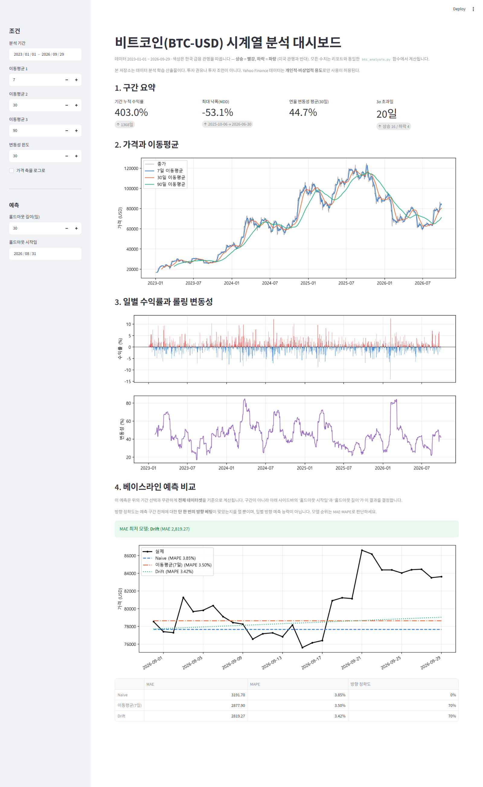
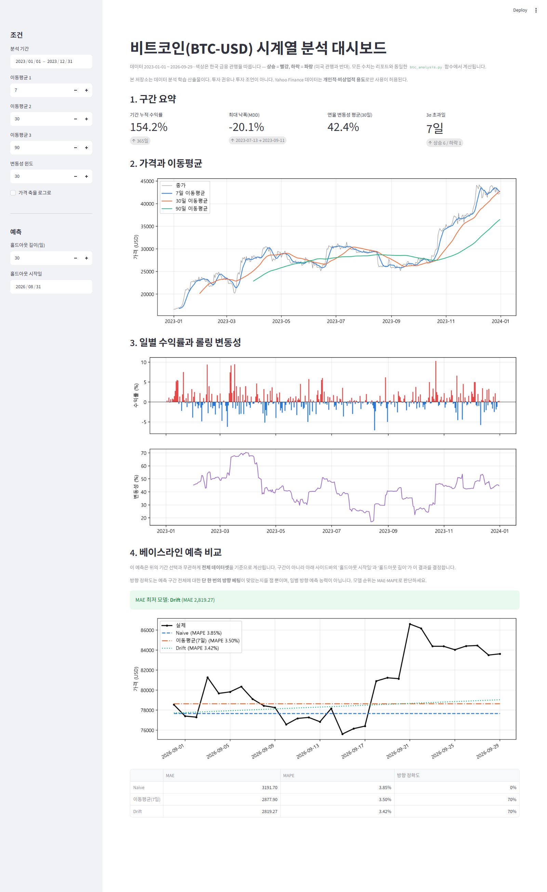
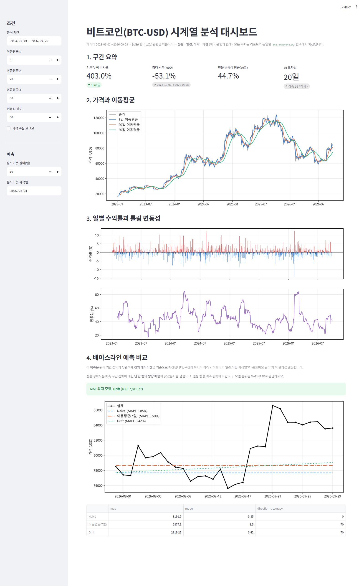
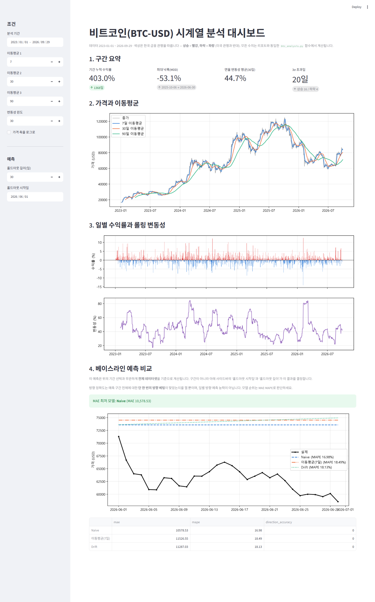

# 비트코인 분석 대시보드 — 시나리오 설명

## 무엇인가

`REPORT.md` 의 분석을 기간·조건을 바꿔가며 탐색할 수 있게 만든 Streamlit 대시보드다.
계산은 전부 `btc_analysis.py` 의 검증된 함수가 수행하므로, 화면의 수치와 리포트의
수치는 같은 코드에서 나온다. `dashboard.py` 는 위젯과 렌더링만 담당하고, 파라미터
검증·구간 슬라이싱은 테스트된 `dashboard_core.py` 가 맡는다.

## 실행

```bash
pip install -r requirements.txt
streamlit run dashboard.py
```

브라우저가 자동으로 열린다(기본 `http://localhost:8501`). 아래 다섯 장면은 위젯을
직접 조작하지 않고 URL 쿼리 파라미터로 상태를 지정해 캡처했다(`capture_screenshots.py`
참고). 예를 들어 장면 5는 다음 주소로 바로 재현된다.

```
http://localhost:8501/?holdout=2026-06-01&horizon=30
```

## 조작할 수 있는 것

| 컨트롤 | 설명 | 범위/기본값 |
| --- | --- | --- |
| 분석 기간 | 상단 가격·수익률·변동성 섹션에 쓰일 구간 | 데이터 범위(2023-01-01 ~ 2026-09-29) 내 임의 구간, 기본 전체 |
| 이동평균 1·2·3 | 섹션 2(가격과 이동평균)에 그릴 세 이동평균의 윈도 길이 | 각 2 ~ 200일, 기본 7 / 30 / 90 |
| 변동성 윈도 | 섹션 1 연율 변동성, 섹션 3 롤링 변동성 계산에 쓰는 윈도 | 5 ~ 120일, 기본 30일 |
| 가격 축을 로그로 | 섹션 2 가격 차트의 y축을 로그 스케일로 전환 | 체크박스, 기본 꺼짐 |
| 홀드아웃 길이(일) | 섹션 4 예측 비교에서 평가할 구간의 길이 | 7 ~ 90일, 기본 30일 |
| 홀드아웃 시작일 | 섹션 4 예측 비교의 시작일. 최소 학습 2일을 보장하도록 가장 이른 값이 제한된다 | 데이터 시작 + 2일 ~ 데이터 끝, 기본 2026-08-31 |

## 장면별 시나리오

### 1. 기본값 — 전체 기간



**설정**: 기간 2023-01-01 ~ 2026-09-29(기본값), 이동평균 7/30/90, 변동성 윈도 30,
홀드아웃 시작일 2026-08-31, 홀드아웃 길이 30일.

**관찰한 것**: 섹션 1 구간 요약은 기간 누적 수익률 403.0%(1368일), 최대 낙폭(MDD)
-53.1%(2025-10-06 → 2026-06-30), 연율 변동성 평균(30일) 44.7%, 3σ 초과일 20일(상승
16 / 하락 4)을 보여준다. 섹션 4 베이스라인 예측 비교에서는 "MAE 최저 모델: Drift
(MAE 2,819.27)"이며, 표의 수치는 Naive(MAE 3191.7, MAPE 3.85%, 방향 정확도 0%),
이동평균(7일)(MAE 2877.9, MAPE 3.50%, 방향 정확도 70%), Drift(MAE 2819.27, MAPE
3.42%, 방향 정확도 70%)다.

**왜 의미 있는가**: 대시보드를 아무 조작 없이 열면 `REPORT.md` 의 본 분석(홀드아웃
2026-08-31, 30일)과 같은 조건이 재현된다. 즉 대시보드의 기본 상태는 리포트의 재현
결과이지, 리포트와 별개인 새로운 탐색이 아니다.

### 2. 기간을 2023년으로 좁히면



**설정**: 기간만 2023-01-01 ~ 2023-12-31로 변경. 이동평균·변동성 윈도·홀드아웃
설정은 기본값 그대로.

**관찰한 것**: 섹션 1이 전부 바뀐다 — 기간 누적 수익률 154.2%(365일), MDD
-20.1%(2023-07-13 → 2023-09-11), 연율 변동성 평균(30일) 42.4%, 3σ 초과일 7일(상승
6 / 하락 1). 섹션 2·3의 차트도 2023년 한 해만 보여주도록 축이 다시 그려진다.
반면 섹션 4의 "MAE 최저 모델: Drift (MAE 2,819.27)"와 표의 수치는 장면 1과 완전히
동일하다.

**왜 의미 있는가**: 구간 요약·가격 차트·수익률 차트는 기간 선택에 즉시 반응하는
것을 확인할 수 있다. 동시에 섹션 4가 전혀 움직이지 않는 것도 확인된다 — 이는
아래 "조작할 수 있는 것"에 설명했듯 섹션 4가 기간 선택과 무관하게 전체 데이터셋을
기준으로 계산되도록 설계되었기 때문이며(화면에도 "이 예측은 위의 기간 선택과
무관하게 전체 데이터셋을 기준으로 계산됩니다"라는 문구가 있다), 버그가 아니다.

### 3. 이동평균을 5/20/60으로 바꾸면



**설정**: 이동평균 1·2·3을 5/20/60으로 변경. 기간은 기본값(전체), 변동성 윈도와
홀드아웃 설정도 기본값 그대로.

**관찰한 것**: 섹션 2의 범례와 선이 "5일 이동평균 / 20일 이동평균 / 60일
이동평균"으로 바뀌고, 7/30/90 대비 가격선에 더 밀착해 따라간다. 섹션 1의 수치(기간
누적 수익률 403.0%, MDD -53.1%, 연율 변동성 평균 44.7%, 3σ 초과일 20일)는 기간이
그대로이므로 장면 1과 동일하다. 섹션 4 역시 "MAE 최저 모델: Drift (MAE 2,819.27)"와
표 수치가 장면 1과 동일하다.

**왜 의미 있는가**: 이동평균 윈도 변경이 섹션 2에만 영향을 주고, 구간 요약(섹션
1)이나 예측 비교(섹션 4)에는 영향을 주지 않는다는 것을 보여준다. 세 컨트롤
(기간, 이동평균, 홀드아웃)이 각자 책임지는 섹션이 분리되어 있다는 것을 장면 2와
함께 확인할 수 있다.

### 4. 홀드아웃 2026-08-31 — 리포트 본 분석


**설정**: `?holdout=2026-08-31&horizon=30` — 이는 모든 컨트롤의 기본값과 정확히
같다.

**관찰한 것**: 이 스크린샷은 장면 1과 화소 단위로 동일하다. 섹션 1부터 섹션 4까지
모든 수치와 차트가 장면 1과 같다(기간 누적 수익률 403.0%, MDD -53.1%, 연율 변동성
44.7%, 3σ 초과일 20일, MAE 최저 모델 Drift·MAE 2,819.27, 표의 Naive/이동평균(7일)
/Drift 수치도 동일).

**왜 의미 있는가**: 이 장면은 독자가 눈으로 구별할 수 있는 변화를 보여주려는 것이
아니다. 솔직하게 말하면 장면 1과 같은 화면이다. 이 장면이 하는 일은 "대시보드의
기본 상태가 곧 리포트 본 분석과 같은 조건"이라는 것을 명시적인 홀드아웃 쿼리
파라미터로 재확인시켜 주는 것이다 — 즉 URL만 봐도 어떤 조건을 재현한 것인지 알 수
있게 만든다. 이 장면의 진짜 역할은 다음 장면(5)과 짝을 이루는 기준점이라는 데
있다.

### 5. 홀드아웃 2026-06-01 — 순위가 뒤집힌다



**설정**: `?holdout=2026-06-01&horizon=30` — 사이드바의 "홀드아웃 시작일"만
2026-08-31에서 2026-06-01로 옮겼다. 기간·이동평균·변동성 윈도는 기본값 그대로.

**관찰한 것**: 섹션 1~3은 기간 선택이 바뀌지 않았으므로 장면 1과 동일하다(403.0%,
-53.1%, 44.7%, 20일). 섹션 4만 완전히 달라진다: "MAE 최저 모델: Naive (MAE
10,578.53)"로 바뀌고, 표는 Naive(MAE 10578.53, MAPE 16.98%, 방향 정확도 0%),
이동평균(7일)(MAE 11526.55, MAPE 18.49%, 방향 정확도 0%), Drift(MAE 11287.03,
MAPE 18.13%, 방향 정확도 0%)를 보여준다. 세 모델 모두 MAE가 장면 4보다 훨씬 크고,
방향 정확도는 세 모델 모두 0%다(이 구간의 실제 가격이 거의 꾸준히 하락했기 때문).

**왜 의미 있는가**: 모델도, 코드도, 다른 컨트롤도 전혀 바꾸지 않고 홀드아웃
시작일 하나만 2026-08-31에서 2026-06-01로 옮겼을 뿐인데 MAE 최저 모델이 Drift에서
Naive로 뒤집힌다. `REPORT.md` 7.4절은 "Drift의 승리는 구간 운에 가깝고, 다른
홀드아웃 구간을 고르면 순위가 바뀔 것"이라고 글로 주장했다. 장면 4와 5를 나란히
두면 독자는 그 주장을 글로만 받아들이는 대신 손으로(URL 하나를 바꿔서) 직접 확인할
수 있다.

## 이 대시보드가 보여주는 것

장면 4와 5를 나란히 두는 이유는, 같은 모델·같은 코드에서 홀드아웃 구간 하나만
바꿨을 때 결과가 어떻게 달라지는지를 독자가 직접 재현해 볼 수 있게 하기 위해서다.
장면 4(홀드아웃 2026-08-31)는 MAE 2,819.27의 Drift가 최저였고, 장면 5(홀드아웃
2026-06-01)는 MAE 10,578.53의 Naive가 최저였다 — 모델 순위 자체가 뒤집혔다.
`REPORT.md` 7.4절이 "Drift의 승리는 구간 운에 가깝다"고 글로 주장한 내용을, 이
대시보드에서는 URL의 날짜 하나만 바꿔서 숫자로 확인할 수 있다. 이것이 대시보드가
단순한 위젯 모음이 아니라 리포트의 주장을 완성하는 도구인 이유다.

같은 맥락에서, 섹션 4가 기간(섹션 1~3을 바꾸는 컨트롤)의 영향을 받지 않고 오직
홀드아웃 컨트롤로만 움직이도록 설계한 것도 의도적이다. 예측 비교가 "지금 보고
있는 구간"이 아니라 "리포트와 비교 가능한 전체 데이터셋"을 기준으로 계산되어야,
장면 2·3에서 확인했듯 기간을 좁혀도 예측 비교 결과가 리포트와 어긋나지 않는다.

위 관찰은 모두 화면에 표시된 수치이고, "구간 운에 가깝다"는 해석은 `REPORT.md`
7.4절의 주장이다. 이 문서는 그 해석을 독자가 검증할 수 있는 장면을 제공할 뿐,
해석 자체를 대신 내리지 않는다.
